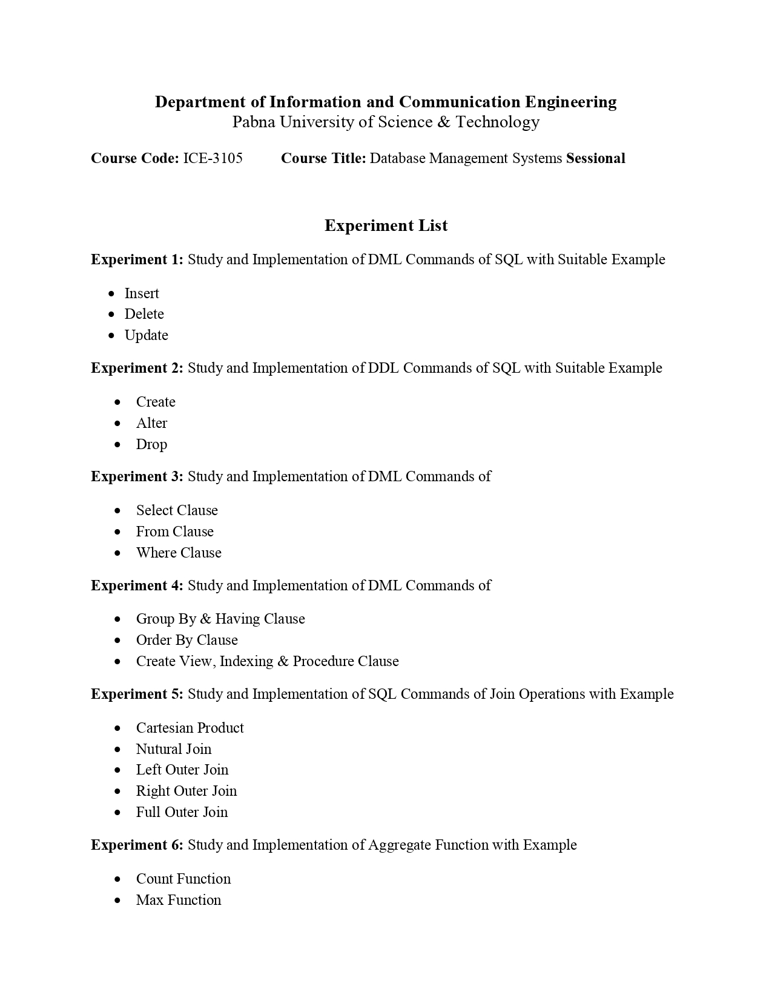
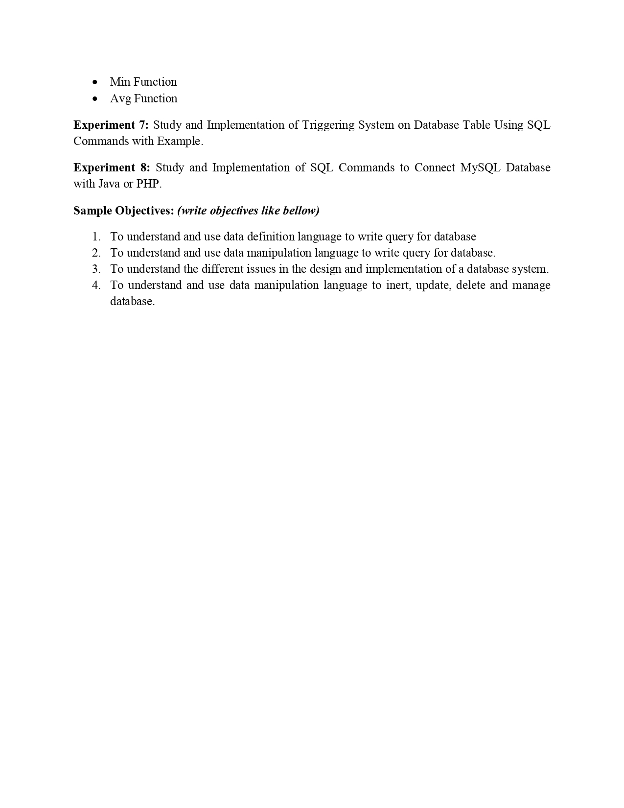

# DBMS

[![Youtube][youtube-shield]][youtube-url]
[![Facebook][facebook-shield]][facebook-url]
[![Instagram][instagram-shield]][instagram-url]
[![LinkedIn][linkedin-shield]][linkedin-url]

Thanks for visiting my GitHub account!

 **Database Management Systems (DBMS)** are software systems used to store, retrieve, and run queries on data. A DBMS serves as an interface between an end-user and a database, allowing users to create, read, update, and delete data in the database.. [see-more](https://www.geeksforgeeks.org/introduction-of-dbms-database-management-system-set-1/)

## For Information

- https://www.w3schools.com/sql/
- https://www.geeksforgeeks.org/sql-tutorial/

## Source Code (Download)

[Click Here](https://mega.nz/folder/tL00VSoQ#E4snCVQ3MAKOd-Nss7sWEA)

## Download Offline

- Download the Full Source Code. visit -> https://mega.nz/folder/oX9jXJAJ#Dh5dpdMGB5SZZ2Dsqe1E6g
- Download Software. visit -> https://mega.nz/file/EHUDDDrQ#HvsoZvjVc9UoLkCVfdDLT0KV0tZ93lR16C-geBGUtiM

## Download Online

- visit ->https://www.microsoft.com/en-us/download/details.aspx?id=101064

## Project Roadmap

|                                |                                |
| :----------------------------: | :----------------------------: |
|               1                |               2                |
|  |  |

## Database Languages

- Data Definition Language
- Data Manipulation Language
- Data Control Language
- Transactional Control Language

## Key Features of DBMS

- **Data modeling:** A DBMS provides tools for creating and modifying data models, which define the structure and relationships of the data in a database.
- **Data storage and retrieval:** A DBMS is responsible for storing and retrieving data from the database, and can provide various methods for searching and querying the data.
- **Concurrency control:** A DBMS provides mechanisms for controlling concurrent access to the database, to ensure that multiple users can access the data without conflicting with each other.
- **Data integrity and security:** A DBMS provides tools for enforcing data integrity and security constraints, such as constraints on the values of data and access controls that restrict who can access the data.
- **Backup and recovery:** A DBMS provides mechanisms for backing up and recovering the data in the event of a system failure.
- **DBMS can be classified into two types:** Relational Database Management System (RDBMS) and Non-Relational Database Management System (NoSQL or Non-SQL)
- **RDBMS:** Data is organized in the form of tables and each table has a set of rows and columns. The data are related to each other through primary and foreign keys.
- **NoSQL:** Data is organized in the form of key-value pairs, documents, graphs, or column-based. These are designed to handle large-scale, high-performance scenarios.

## Several Types of DBMS

- Relational DBMS (RDBMS): An RDBMS stores data in tables with rows and columns, and uses SQL (Structured Query Language) to manipulate the data.
- Object-Oriented DBMS (OODBMS): An OODBMS stores data as objects, which can be manipulated using object-oriented programming languages.
- NoSQL DBMS: A NoSQL DBMS stores data in non-relational data structures, such as key-value pairs, document-based models, or graph models.

## Applications of DBMS:

- Enterprise Information: Sales, accounting, human resources, Manufacturing, online retailers.
- Banking and Finance Sector: Banks maintaining the customer details, accounts, loans, banking transactions, credit card transactions.
- Finance: Storing the information about sales and holdings, purchasing of financial stocks and bonds.
- University: Maintaining the information about student course enrolled information, student grades, staff roles.
- Airlines: Reservations and schedules.
- Telecommunications: Prepaid, postpaid bills maintance.

## Follow Me

    

<!-- MARKDOWN LINKS & IMAGES -->

[youtube-shield]: https://img.shields.io/badge/-Youtube-black.svg?style=flat-square&logo=youtube&color=555&logoColor=white
[youtube-url]: https://youtube.com/@learnwithfair
[facebook-shield]: https://img.shields.io/badge/-Facebook-black.svg?style=flat-square&logo=facebook&color=555&logoColor=white
[facebook-url]: https://facebook.com/learnwithfair
[instagram-shield]: https://img.shields.io/badge/-Instagram-black.svg?style=flat-square&logo=instagram&color=555&logoColor=white
[instagram-url]: https://instagram.com/learnwithfair
[linkedin-shield]: https://img.shields.io/badge/-LinkedIn-black.svg?style=flat-square&logo=linkedin&colorB=555
[linkedin-url]: https://linkedin.com/company/learnwithfair
